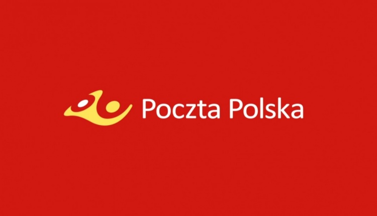
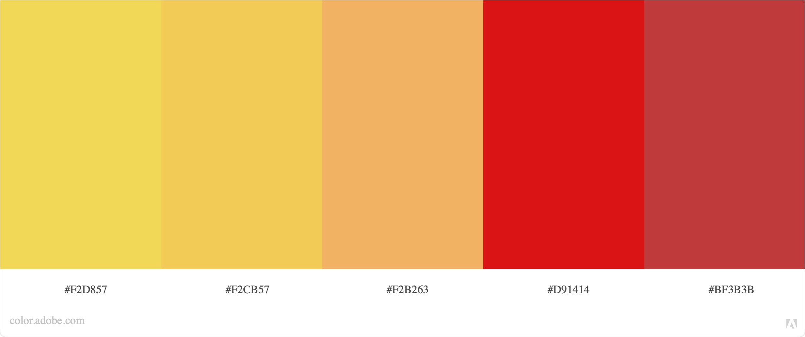

[Redisign for emonitoring.poczta-polska.pl](https://zhekazuev.github.io/emonitoring-poczta-polska/])
# Emonitoring Poczta Polska

## About

Redisign for poczta-polska.pl and emonitoring.poczta-polska.pl

Curent Stack:
- Bootstrap
- PHP/WordPress
- MySQL
- Google Font API

## Pallete and Design:




## How it works:

Request
```bash
curl --location --request POST 'https://uss.poczta-polska.pl/uss/v1.0/tracking/checkmailex' \
--header 'API_KEY:  Bi...6' \
--header 'POST:  /uss/v1.0/tracking/checkmailex HTTP/1.1' \
--header 'Content-Type:  application/json; charset=utf-8' \
--header 'Origin:  https://emonitoring.poczta-polska.pl' \
--header 'Referer:  https://emonitoring.poczta-polska.pl/' \
--header 'Content-Length:  67' \
--header 'Host:  uss.poczta-polska.pl' \
--header 'Accept-Language:  en-gb' \
--header 'Cookie: TS0...=' \
--data-raw '{"language":"PL","number":"CP00000000PL","addPostOfficeInfo":true}'
```
Response
```json
{
    "mailInfo": {
        "number": "CP00000000PL",
        "dispatchDate": "2021-11-04T00:00:00",
        "dispatchCountryCode": "PL",
        "dispatchCountryName": "Poland",
        "dispatchPostOffice": {
            "code": "000000",
            "name": "UP Warszawa 1",
            "description": {
                "longitude": 0,
                "latitude": 0,
                "openingHours": {
                    "businessDays": [
                        {
                            "from": "08:00:00",
                            "to": "20:00:59"
                        }
                    ]
                },
                "city": "Warszawa",
                "houseNumber": "1",
                "zipCode": "00-000",
                "street": "ul. Test"
            }
        },
        "recipientCountryCode": "BY",
        "recipientCountryName": "Belarus",
        "typeOfMailCode": "P",
        "typeOfMailName": "Economical postal parcel",
        "weight": 2.01,
        "finished": true,
        "events": [
            {
                "code": "P_NAD",
                "name": "Posted",
                "time": "2021-11-04T19:05:00",
                "postOffice": {
                    "code": "000000",
                    "name": "UP Warszawa 1",
                    "description": {
                        "longitude": 0,
                        "latitude": 0,
                        "openingHours": {
                            "businessDays": [
                                {
                                    "from": "08:00:00",
                                    "to": "20:00:59"
                                }
                            ]
                        },
                        "city": "Warszawa",
                        "houseNumber": "1",
                        "zipCode": "00-000",
                        "street": "ul. Test"
                    }
                },
                "finished": false,
                "canceled": false
            },
            {
                "code": "P_WZL",
                "name": "Package sent ",
                "time": "2021-11-04T20:05:00",
                "postOffice": {
                    "code": "000000",
                    "name": "UP Warszawa 1",
                    "description": {
                        "longitude": 0,
                        "latitude": 0,
                        "openingHours": {
                            "businessDays": [
                                {
                                    "from": "08:00:00",
                                    "to": "20:00:59"
                                }
                            ]
                        },
                        "city": "Warszawa",
                        "houseNumber": "1",
                        "zipCode": "00-000",
                        "street": "ul. Test"
                    }
                },
                "finished": false,
                "canceled": false
            },
            {
                "code": "P_PZL",
                "name": "Item arrived",
                "time": "2021-11-04T22:07:00",
                "postOffice": {
                    "name": "Transshipment"
                },
                "finished": false,
                "canceled": false
            },
            {
                "code": "P_WYPL",
                "name": "Sent from Poland",
                "time": "2021-11-08T14:18:00",
                "postOffice": {
                    "code": "000000",
                    "name": "WER Warszawa",
                    "description": {
                        "longitude": 21.001944,
                        "latitude": 52.160055,
                        "openingHours": {},
                        "city": "Warszawa",
                        "houseNumber": "1",
                        "zipCode": "00-000",
                        "street": "ul. Test 2"
                    }
                },
                "finished": false,
                "canceled": false
            },
            {
                "code": "P_WZL",
                "name": "Package sent ",
                "time": "2021-11-11T10:19:00",
                "postOffice": {
                    "name": "Transshipment"
                },
                "finished": false,
                "canceled": false
            },
            {
                "code": "P_WEOC",
                "name": "Accepted in the destination country",
                "time": "2021-11-13T13:27:00",
                "postOffice": {
                    "name": "MINSK PI 0",
                    "description": {
                        "longitude": 0,
                        "latitude": 0,
                        "openingHours": {}
                    }
                },
                "finished": false,
                "canceled": false
            },
            {
                "code": "P_ZPUCPP",
                "name": "Pre-customs declaration stage",
                "time": "2021-11-13T13:33:00",
                "postOffice": {
                    "name": "MINSK PI 0",
                    "description": {
                        "longitude": 0,
                        "latitude": 0,
                        "openingHours": {}
                    }
                },
                "finished": false,
                "canceled": false
            },
            {
                "code": "P_WZL",
                "name": "Package sent ",
                "time": "2021-11-14T14:54:00",
                "postOffice": {
                    "name": "MINSK PI 0",
                    "description": {
                        "longitude": 0,
                        "latitude": 0,
                        "openingHours": {}
                    }
                },
                "finished": false,
                "canceled": false
            },
            {
                "code": "P_RUD",
                "name": "Item arrived",
                "time": "2021-11-14T17:45:00",
                "postOffice": {
                    "name": "International Postal System"
                },
                "finished": false,
                "canceled": false
            },
            {
                "code": "P_NDPJ",
                "name": "Missed delivery",
                "time": "2021-11-14T20:13:00",
                "cause": {
                    "code": "P_ND_Z",
                    "name": "Addressee not present / addressee's registered office closed"
                },
                "postOffice": {
                    "name": "International Postal System"
                },
                "finished": false,
                "canceled": false
            },
            {
                "code": "P_D",
                "name": "Item delivered",
                "time": "2021-11-16T18:17:00",
                "postOffice": {
                    "name": "International Postal System"
                },
                "finished": true,
                "canceled": false
            }
        ]
    },
    "number": "CP00000000PL",
    "mailStatus": 0
}
```

## References 

There are the recommendations for tracking parcels.
For example, make a list of movements in the form of a timeline, and not a list, as is done by Fedex.
- [16 советов](https://vc.ru/design/74245-sdelat-otslezhivanie-posylok-ponyatnym-dlya-polzovatelya-16-sovetov-po-razrabotke-dizayna-stranic-i-uvedomleniy)
- [Gilt](https://help.gilt.com/hc/en-us/articles/360005927933-Tracking-Your-Order)
- [Fedex](https://www.fedex.com/en-us/home.html)

There are recommendations for site structure and button placement are described here - cool modern design code.
- [EMS – курьерская служба. Почты России](https://www.pochta.ru/emspost/)
- [Почта России](https://www.pochta.ru/tracking)
- [БелПочта](https://belpost.by/Otsleditotpravleniye)
- [Pocztex Tracking](https://www.pocztex.pl/track-shipment/)

Here are examples: the current normal design code poczta-polskа.pl, color scheme (white, red, yellow-gold - the national colors of Poland).
- [e-Doręczenie](https://edoreczenia.poczta-polska.pl)
- [Odbiorwpunkcie](https://odbiorwpunkcie.poczta-polska.pl/en/)
- [Uzyskaj adres do e-Doręczeń u publicznego dostawcy usługi](https://www.gov.pl/web/gov/uzyskaj-adres-do-e-doreczen-u-publicznego-dostawcy-uslugi-e-doreczen)
- [e-Doręczenia dla przedsiębiorców](https://www.biznes.gov.pl/pl/portal/03176)
